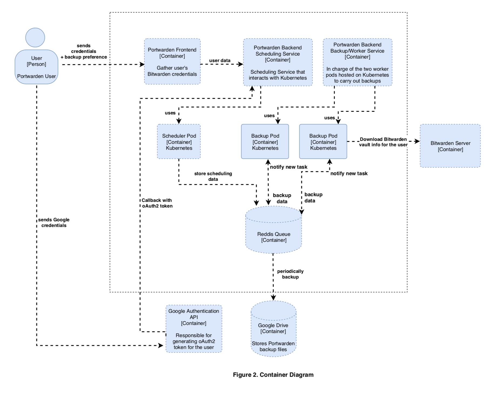
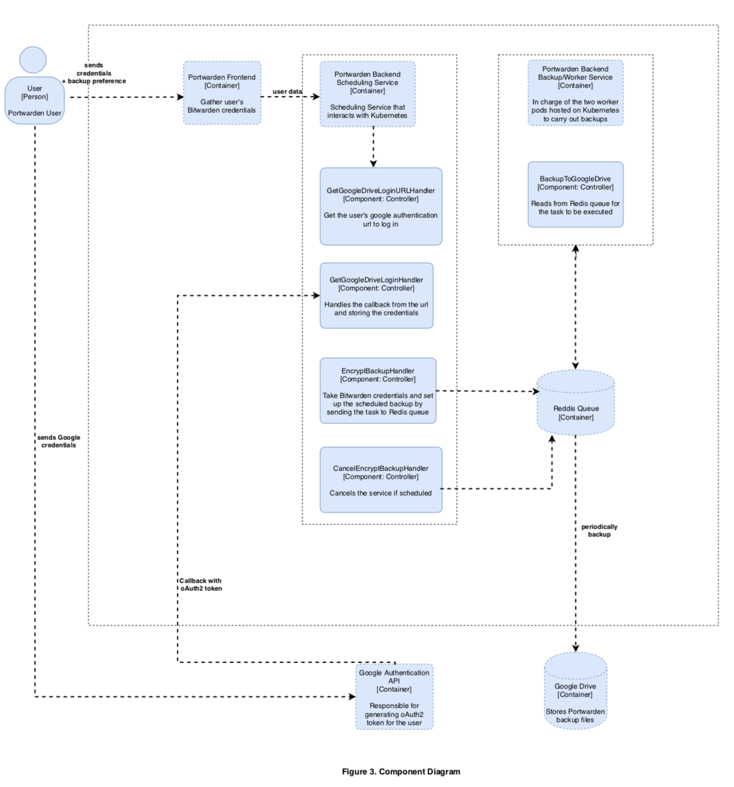

# PortWarden


[](https://dev.costa.sh/vwxyzjn/portwarden)


This project creates encrypted backups for [Bitwarden](https://bitwarden.com/) vaults including attachments. It pulls your vault items from [Bitwarden CLI](https://github.com/bitwarden/cli) and download all the attachments associated with those items to a temporary backup folder. Then, portwarden zip that folder, encrypt it with a passphrase, and delete the temporary folder. 


It addresses this issue in the community forum https://community.bitwarden.com/t/encrypted-export/235, but hopefully Bitwarden will come up with official solutions soon.

## Usage Of Portwarden CLI

Go to https://github.com/bitwarden/cli/releases to download the latest version of Bitwarden CLI and place the executable `bw`/`bw.exe` in your `PATH`. Then, go to https://github.com/vwxyzjn/portwarden/releases/ to download the latest release of `portwarden`. Now just follow the steps in the following Gif:


```bash
portwarden --passphrase 1234 --filename backup.portwarden encrypt
portwarden --passphrase 1234 --filename backup.portwarden decrypt
portwarden --passphrase 1234 --filename backup.portwarden restore
```

## Usage of Portwarden Server (Setup Scheduled Backup)

Make sure you have [Docker](https://docs.docker.com/install/) installed and ports 8000, 8081, 5000 unused. Then download https://github.com/vwxyzjn/portwarden/blob/master/k8s/docker-compose.build.yaml to a folder and ❗ **name the file `docker-compose.yaml`** ❗  and run

```bash
$ # Make sure your server has docker installed.
$ # if you are using remote server, use the following line to forward the server's host to your local machine
$ ssh -L 8000:temp2uk4muy.costa.sh:8000 -L 8081:temp2uk4muy.costa.sh:8081 -L 5000:temp2uk4muy.costa.sh:5000 costa@temp2uk4muy.costa.sh
$ wget https://raw.githubusercontent.com/vwxyzjn/portwarden/master/k8s/docker-compose.build.yaml -O docker-compose.yaml
$ docker-compose up -d
WARNING: Some services (worker) use the 'deploy' key, which will be ignored. Compose does not support 'deploy' configuration - use `docker stack deploy` to deploy to a swarm.
Creating network "portwarden_default" with the default driver
Creating portwarden_redis-commander_1_4e61af10bd41 ... done
Creating portwarden_frontend_1_8671b96c9489        ... done
Creating portwarden_redis_1_63f811026265           ... done
Creating portwarden_scheduler_1_f506c63e5915       ... done
Creating portwarden_worker_1_37de363b0d28          ... done
$ docker ps
CONTAINER ID        IMAGE                                   COMMAND                  CREATED             STATUS              PORTS                    NAMES
188bfb9d4eba        vwxyzjn/portwarden-server-prod:1.7.1    "./scheduler"            11 seconds ago      Up 8 seconds        0.0.0.0:5000->5000/tcp   portwarden_scheduler_1_127af4e9821a
9cb2a5221b2b        vwxyzjn/portwarden-server-prod:1.7.1    "./worker"               11 seconds ago      Up 9 seconds        5000/tcp                 portwarden_worker_1_1a0247e3be8f
c6967ada50c6        redis                                   "docker-entrypoint..."   13 seconds ago      Up 11 seconds       6379/tcp                 portwarden_redis_1_14ee2e0a7e97
472d6d2e7f60        vwxyzjn/portwarden-frontend:1.2.0       "yarn start"             13 seconds ago      Up 11 seconds       0.0.0.0:8000->8000/tcp   portwarden_frontend_1_55788d316890
ddfbc57a74a0        rediscommander/redis-commander:latest   "/usr/bin/dumb-ini..."   13 seconds ago      Up 11 seconds       0.0.0.0:8081->8081/tcp   portwarden_redis-commander_1_1a656d418a10
```

After the services are spinned up, go to http://localhost:8000 and follow the steps to setup scheduled backups.

You will probably have to host Portwarden Server on your machine or server. One caveat is that Portwarden Server does *store your encryption key* (not your master password) and I don't feel comfortable managing your credentials. This server is really for my personal use and a demonstration of the modern architecture for my Software Design class (see below)

Feel free to watch the following Gif on how to set it up. If you need a control bar, please go to https://imgur.com/a/4Vy1Hat


## Portwarden Compared with Official Bitwarden Backup (As of 12/5/2018)
||Portwarden|Official Bitwarden Backup|
|:---|:---|:---|
|Backend|golang|C#|
|Backup Format|:heavy_check_mark: AES-Encrypted `.portwarden` format| Unencrypted CSV file|
|Backup With Attachments|:heavy_check_mark:|Not supported (see [this feature request](https://community.bitwarden.com/t/allow-attachments-to-be-exported-when-using-export-data))
|Scheduled Backup|:heavy_check_mark: Use Portwarden Server (Experimental)|Not supported|

## Contribution & Development

Clone this repo. Make sure you have [Docker](https://docs.docker.com/install/) installed, ports 8000, 8081, 5000 unused, [Golang](https://golang.org/) installed, [dep](https://golang.github.io/dep/) installed. In addition, create an environment varialble `Salt` of length 30 for encryption salt. Then run 

```bash
dep ensure           # Install go dependencies
docker-compose up -d # Spin up required containers

# After the services/containers are created successfully, you should see
# $ docker-compose up  -d
# WARNING: Some services (worker) use the 'deploy' key, which will be ignored. Compose does not support 'deploy' configuration - use `docker stack deploy` to deploy to a swarm.
# Creating network "portwarden_default" with the default driver
# Creating portwarden_redis_1           ... done
# Creating portwarden_redis-commander_1 ... done
# Creating portwarden_frontend_1        ... done
# Creating portwarden_worker_1          ... done
# Creating portwarden_scheduler_1       ... done

docker ps # checkout the running containers
# $ docker ps
# CONTAINER ID        IMAGE                                   COMMAND                  CREATED             STATUS              PORTS                    NAMES
# e9bbc7263189        vwxyzjn/portwarden-base:1.1.0           "/bin/bash"              15 seconds ago      Up 12 seconds       0.0.0.0:5000->5000/tcp   portwarden_scheduler_1
# f44247d80881        vwxyzjn/portwarden-base:1.1.0           "go run main.go"         15 seconds ago      Up 12 seconds       5000/tcp                 portwarden_worker_1
# 37deb1556391        vwxyzjn/portwarden-frontend:1.0.1       "/bin/sh -c 'npm run…"   17 seconds ago      Up 14 seconds       0.0.0.0:8000->8000/tcp   portwarden_frontend_1
# 6ab98b5515f1        redis                                   "docker-entrypoint.s…"   17 seconds ago      Up 14 seconds       0.0.0.0:6379->6379/tcp   portwarden_redis_1
# 78618bb157d2        rediscommander/redis-commander:latest   "/usr/bin/dumb-init …"   17 seconds ago      Up 14 seconds       0.0.0.0:8081->8081/tcp   portwarden_redis-commander_1

docker exec -it portwarden_scheduler_1 bash # get into scheduler container and do whatever you want.

# $ docker exec -it portwarden_scheduler_1 bash
# root@582b98fa1a25:/go/src/github.com/vwxyzjn/portwarden/web/scheduler# go run main.go
# (string) (len=24) "Scheduler Server Started"
# [GIN-debug] [WARNING] Now Gin requires Go 1.6 or later and Go 1.7 will be required soon.

# [GIN-debug] [WARNING] Creating an Engine instance with the Logger and Recovery middleware already attached.

# [GIN-debug] [WARNING] Running in "debug" mode. Switch to "release" mode in production.
#  - using env:   export GIN_MODE=release
#  - using code:  gin.SetMode(gin.ReleaseMode)

# [GIN-debug] GET    /                         --> github.com/vwxyzjn/portwarden/web/scheduler/server.(*PortwardenServer).Run.func1 (4 handlers)
# [GIN-debug] POST   /decrypt                  --> github.com/vwxyzjn/portwarden/web/scheduler/server.DecryptBackupHandler (4 handlers)
# [GIN-debug] GET    /gdrive/loginUrl          --> github.com/vwxyzjn/portwarden/web/scheduler/server.(*PortwardenServer).GetGoogleDriveLoginURLHandler-fm (4 handlers)
# [GIN-debug] GET    /gdrive/login             --> github.com/vwxyzjn/portwarden/web/scheduler/server.(*PortwardenServer).GetGoogleDriveLoginHandler-fm (4 handlers)
# [GIN-debug] GET    /test/TokenAuthMiddleware --> github.com/vwxyzjn/portwarden/web/scheduler/server.(*PortwardenServer).Run.func2 (5 handlers)
# [GIN-debug] POST   /encrypt                  --> github.com/vwxyzjn/portwarden/web/scheduler/server.EncryptBackupHandler (5 handlers)
# [GIN-debug] POST   /encrypt/cancel           --> github.com/vwxyzjn/portwarden/web/scheduler/server.CancelEncryptBackupHandler (5 handlers)
# [GIN-debug] Listening and serving HTTP on :5000
```

Notice the `docker-compose.yaml` file defines the services running and it's mounting your current directory as volumes and map it to the container's working directory. This means you can develop/make changes in your local machine, and run it in the container. It also maps certain containers' ports into your host so that you can call the endpoints.


PRs are welcome. For ideas, you could probably add a progress bar to the CLI. 

## Project Proposal for Software Design Course (SE-575) at Drexel University

This section is experimental and for fun.

I currently taking this class, and our final project is suppose to demonstrate some traits of the modern software architecture. So my teammate [Samridh Prasad](https://github.com/samridhprasad) and I figure we can probably add some components to Portwarden to make it more interesting. Couple initial deliverables are listed below:

### Backend server
- [x] Write a backend server by Go in the `portwarden/web` folder.
- [x] Allow Bitwarden User to login and periodically back up their vault to Google Drive.
- [x] If the user has attachments, download them in every 300 milliseconds because we don't want to get blacklisted. This means we probably want a queue (Maybe use Kafka?) as part of the architecture.
- [ ] Use Let's encrypt to make the server use HTTPS protocal.


### Frontend 
- [x] Has a **simple** front end that gets user's username and password and show them if the backup process has begun.
- [x] Allow the user to cancel such backup process if he/she wants. 

### System Architecture
We tried to avoid being boxed by a layered architecture and strived to conform to C4 standards best we could and ensured the code reflects the architecture. Overall, we found the lectures and assigned readings to greatly improve our ability to design scalable system architecture.
#### Context Diagram
Figure 1 maps out the basic systems involved with Portwarden and how they interact with each other.

#### Container Diagram
Figure 2 provides a more in-depth view of the system breaking the system down into containers with arrows depicting the data flow.

#### Component Diagram
Figure 3 drills down into the most critical containers: the Backend Scheduling Service and the Backend Backup/Worker Service. The boundaries for the containers are clearly marked to provide clarity to the reader. 


