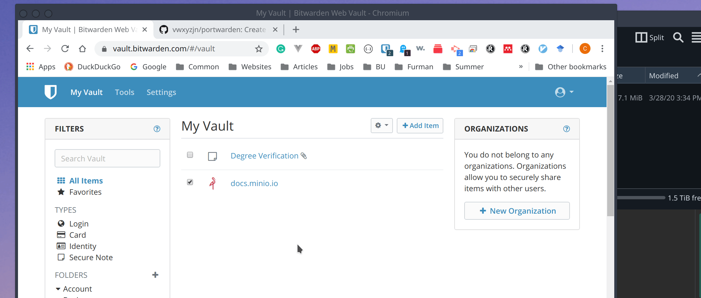
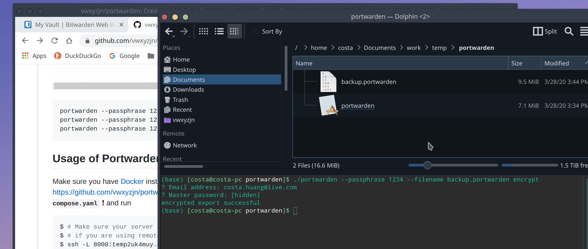

# PortWarden


This project creates encrypted backups for [Bitwarden](https://bitwarden.com/) vaults including attachments. It pulls your vault items from [Bitwarden CLI](https://github.com/bitwarden/cli) and download all the attachments associated with those items to a temporary backup folder. Then, portwarden zip that folder, encrypt it with a passphrase, and delete the temporary folder. 


It addresses this issue in the community forum https://community.bitwarden.com/t/encrypted-export/235, but hopefully Bitwarden will come up with official solutions soon.

## 3/28/20 Update

We now support restoring the backup to an empty account, including attachments.

# Disclaimer
Note that you **may lose your data** if you try the restore feature and I am not responsible. Use the free software at your own discretion.  Since we don't handle restoration conflicts,  **make sure to back up with your main account and restore to a spare/alternative account**. 


## Usage Of Portwarden CLI

Go to https://github.com/bitwarden/cli/releases to download the latest version of Bitwarden CLI and place the executable `bw`/`bw.exe` in your `PATH`. Then, go to https://github.com/vwxyzjn/portwarden/releases/ to download the latest release of `portwarden`. Now just follow these steps :


```bash
# If you are running self hosted instance, execute `bw config server https://MYSERVER.COM`
portwarden --passphrase 1234 --filename backup.portwarden encrypt
portwarden --passphrase 1234 --filename backup.portwarden decrypt
# RESTORE IS EXPERIMENTAL!! YOU MAY LOSE YOUR DATA
# IF YOU RESTORE TO YOUR MAIN ACCOUNT
# PLEASE MAKE SURE YOU KNOW WHAT YOU ARE DOING

# Please use a **spare** account for restoring backup
# Portwarden doesn't handle conflicts therefore a
# separate account is needed

# In fact we setup a check to make sure the account your
# are restoring to does not have any data in it
portwarden --passphrase 1234 --filename backup.portwarden restore
```
### Demo Backup



### Demo Decrypt



### Demo restore


## Portwarden Compared with Official Bitwarden Backup (As of 12/5/2018)
||Portwarden|Official Bitwarden Backup|
|:---|:---|:---|
|Backend|golang|C#|
|Backup Format|:heavy_check_mark: AES-Encrypted `.portwarden` format| Unencrypted CSV file|
|Backup With Attachments|:heavy_check_mark:|Not supported (see [this feature request](https://community.bitwarden.com/t/allow-attachments-to-be-exported-when-using-export-data))
|Restore Attachments|:heavy_check_mark: Supported|Not supported|

## Contribution & Development

Clone this repo. Make sure you have [Docker](https://docs.docker.com/install/) installed, ports 8000, 8081, 5000 unused, [Golang](https://golang.org/) installed, [dep](https://golang.github.io/dep/) installed. In addition, create an environment varialble `Salt` of length 30 for encryption salt. Then run 

```bash
dep ensure           # Install go dependencies
docker-compose up -d # Spin up required containers

# After the services/containers are created successfully, you should see
# $ docker-compose up  -d
# WARNING: Some services (worker) use the 'deploy' key, which will be ignored. Compose does not support 'deploy' configuration - use `docker stack deploy` to deploy to a swarm.
# Creating network "portwarden_default" with the default driver
# Creating portwarden_redis_1           ... done
# Creating portwarden_redis-commander_1 ... done
# Creating portwarden_frontend_1        ... done
# Creating portwarden_worker_1          ... done
# Creating portwarden_scheduler_1       ... done

docker ps # checkout the running containers
# $ docker ps
# CONTAINER ID        IMAGE                                   COMMAND                  CREATED             STATUS              PORTS                    NAMES
# e9bbc7263189        vwxyzjn/portwarden-base:1.1.0           "/bin/bash"              15 seconds ago      Up 12 seconds       0.0.0.0:5000->5000/tcp   portwarden_scheduler_1
# f44247d80881        vwxyzjn/portwarden-base:1.1.0           "go run main.go"         15 seconds ago      Up 12 seconds       5000/tcp                 portwarden_worker_1
# 37deb1556391        vwxyzjn/portwarden-frontend:1.0.1       "/bin/sh -c 'npm run…"   17 seconds ago      Up 14 seconds       0.0.0.0:8000->8000/tcp   portwarden_frontend_1
# 6ab98b5515f1        redis                                   "docker-entrypoint.s…"   17 seconds ago      Up 14 seconds       0.0.0.0:6379->6379/tcp   portwarden_redis_1
# 78618bb157d2        rediscommander/redis-commander:latest   "/usr/bin/dumb-init …"   17 seconds ago      Up 14 seconds       0.0.0.0:8081->8081/tcp   portwarden_redis-commander_1

docker exec -it portwarden_scheduler_1 bash # get into scheduler container and do whatever you want.

# $ docker exec -it portwarden_scheduler_1 bash
# root@582b98fa1a25:/go/src/github.com/vwxyzjn/portwarden/web/scheduler# go run main.go
# (string) (len=24) "Scheduler Server Started"
# [GIN-debug] [WARNING] Now Gin requires Go 1.6 or later and Go 1.7 will be required soon.

# [GIN-debug] [WARNING] Creating an Engine instance with the Logger and Recovery middleware already attached.

# [GIN-debug] [WARNING] Running in "debug" mode. Switch to "release" mode in production.
#  - using env:   export GIN_MODE=release
#  - using code:  gin.SetMode(gin.ReleaseMode)

# [GIN-debug] GET    /                         --> github.com/vwxyzjn/portwarden/web/scheduler/server.(*PortwardenServer).Run.func1 (4 handlers)
# [GIN-debug] POST   /decrypt                  --> github.com/vwxyzjn/portwarden/web/scheduler/server.DecryptBackupHandler (4 handlers)
# [GIN-debug] GET    /gdrive/loginUrl          --> github.com/vwxyzjn/portwarden/web/scheduler/server.(*PortwardenServer).GetGoogleDriveLoginURLHandler-fm (4 handlers)
# [GIN-debug] GET    /gdrive/login             --> github.com/vwxyzjn/portwarden/web/scheduler/server.(*PortwardenServer).GetGoogleDriveLoginHandler-fm (4 handlers)
# [GIN-debug] GET    /test/TokenAuthMiddleware --> github.com/vwxyzjn/portwarden/web/scheduler/server.(*PortwardenServer).Run.func2 (5 handlers)
# [GIN-debug] POST   /encrypt                  --> github.com/vwxyzjn/portwarden/web/scheduler/server.EncryptBackupHandler (5 handlers)
# [GIN-debug] POST   /encrypt/cancel           --> github.com/vwxyzjn/portwarden/web/scheduler/server.CancelEncryptBackupHandler (5 handlers)
# [GIN-debug] Listening and serving HTTP on :5000
```

Notice the `docker-compose.yaml` file defines the services running and it's mounting your current directory as volumes and map it to the container's working directory. This means you can develop/make changes in your local machine, and run it in the container. It also maps certain containers' ports into your host so that you can call the endpoints.


PRs are welcome. For ideas, you could probably add a progress bar to the CLI. 
