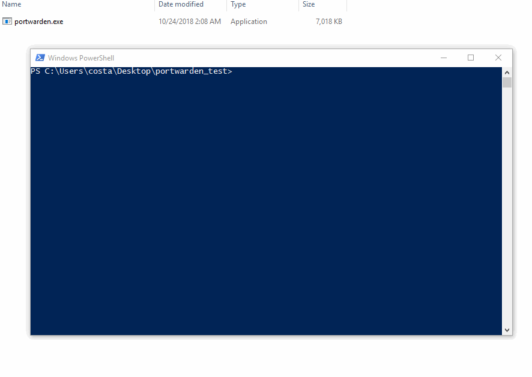
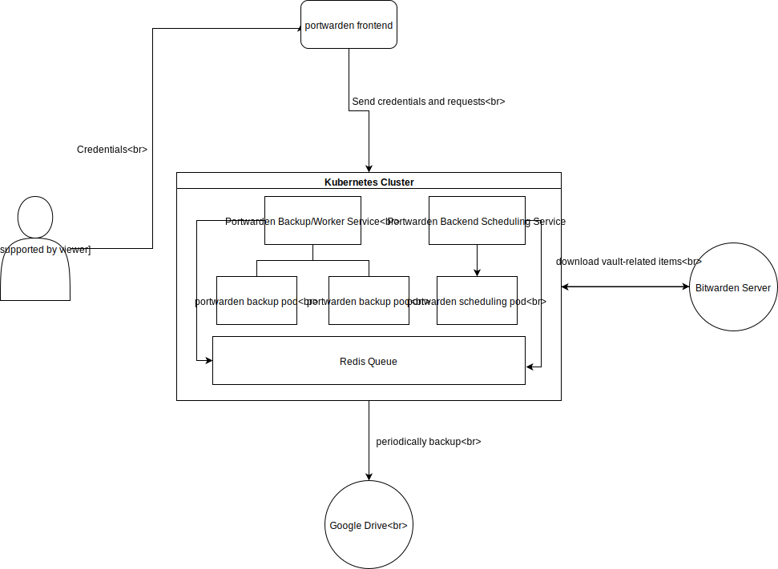

# PortWarden

This project provides encrypted backups for (Bitwarden)[https://bitwarden.com/] vaults, including attachments. It pulls your vault items from (Bitwarden CLI)[https://github.com/bitwarden/cli] and download all the attachments associated with those items to a temporary backup folder. Then, portwarden zip that folder, encrypt it with a passphrase, and delete the temporary folder. 

It addresses this issue in the community forum https://community.bitwarden.com/t/encrypted-export/235, but hopefully Bitwarden will come up with official solutions soon.

## Usage

Go to https://github.com/bitwarden/cli/releases to download the latest version of Bitwarden CLI and place the executable `bw`/`bw.exe` in your `PATH`. Then, go to https://github.com/vwxyzjn/portwarden/releases/ to downlaod the latest release of `portwarden`. Now just follow the steps in the following Gif:

## Contribution 

PRs are welcome. For ideas, you could probably add a progress bar. 

## Project Proposal for Software Design Course (SE-575) at Drexel University

This section is experimental and for fun.

I currently taking this class, and our final project is suppose to demonstrate some traits of the modern software architecture. So my teammate [Samridh Prasad](https://github.com/samridhprasad) and I figure we can probably add some components to Portwarden to make it more interesting. Couple initial deliverables are listed below:

### Backend server
- [ ] Write a backend server by Go in the `portwarden/web` folder.
- [ ] Allow Bitwarden User to login and periodically back up their vault to Google Drive.
- [ ] If the user has attachments, download them in every 300 milliseconds because we don't want to get blacklisted. This means we probably want a queue (Maybe use Kafka?) as part of the architecture.
- [ ] Use Let's encrypt to make the server use HTTPS protocal.

### Frontend 
- [ ] Has a **simple** front end that gets user's username and password and show them if the backup process has begun.
- [ ] Allow the user to cancel such backup process if he/she wants. 

### Architecture Diagram

It probably looks something like this:

